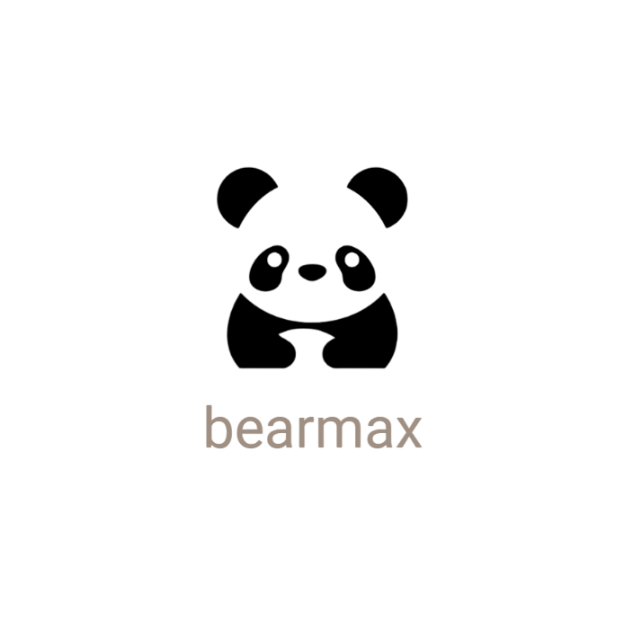

<center>
  
</center>

# BearMax App V2
This is version 2 of the BearMax mobile app. This app is the command interface for BearMax, a robot for facilitating social-emotional learning for children with Autism Spectrum Disorder. With the mobile app, the user can interact with the robot, customize their profiles, and record patient notes.

## Features
The cross-platform app includes: 

- **Sensory Overload Aid**: Users can upload and favorite MP3 and MP4 files to be sent to the robot's screen to provide calming stimuli for a child experiencing sensory overload.
- **Match the Pose**: Users can choose from a variety of pre-set poses that will display as movement from the robot for the child to match.
- **Patient Notes**: Users can add, edit, and delete patient notes to monitor the child's progress.
- **Profile Customization**: Users can modify personal information through the profile.
- **Account**: Connect or create your [bearmaxcare.com](https://bearmaxcare.com/) account.
- **Platform**: Use with Android or iOS.


## Run with Virtual Emulator
- Install Android Studio and add the desired Android device.
- Connect the device to Visual Studio Code.
- Clone this repository.
- Navigate to the project directory.\
``` cd bearmax ```
- Install dependencies\
``` flutter pub get ``` 

- Run the app\
``` flutter run ```